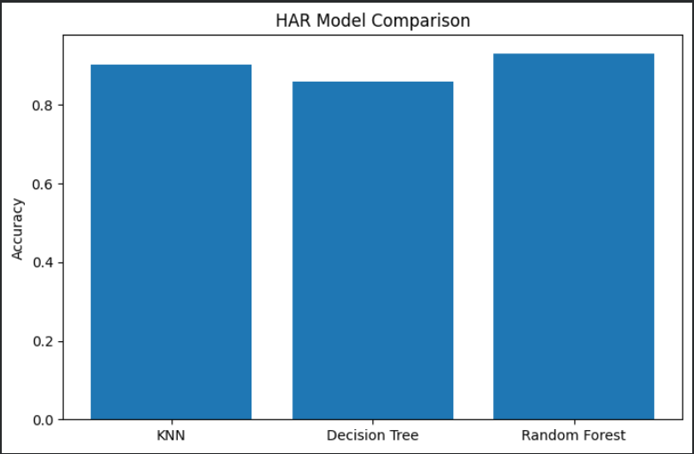
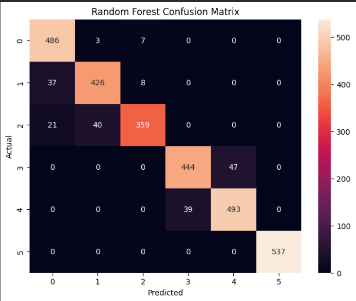

# Human Activity Recognition using Machine Learning

This project demonstrates Human Activity Recognition (HAR) using machine learning techniques on smartphone sensor data from the UCI HAR dataset.

## Models Used
- Random Forest
- K-Nearest Neighbors (KNN)
- Decision Tree

## Dataset
UCI Human Activity Recognition Dataset

## Features
- Activity classification
- Model comparison
- Confusion matrix visualization
- Accuracy analysis

## Results

Random Forest achieved the highest accuracy among the tested models.

## Model Comparison

## Confusion Matrix

## Future Improvements

- CNN and LSTM implementation
- Real-time IoT sensor integration
- Smart healthcare monitoring systems
